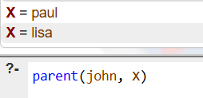
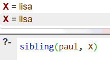
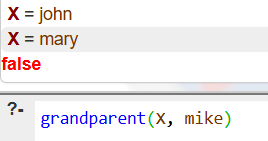
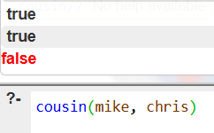
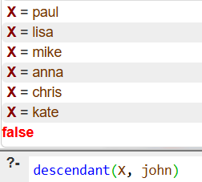

# Sample Queries and Expected Output

1. Who are the children of John?

``` bash
?- parent(john, X).
```

### Output



2. Who are the siblings of Paul?

``` bash
?- sibling(paul, X).
```

### Output



3. Who are the grandparents of Mike?

``` bash
?- grandparent(X, mike).
```

### Output



4. Is Mike a cousin of Chris?

``` bash
?- cousin(mike, chris).
```

### Output



5. Who are all descendants of John?

``` bash
?- descendant(X, john).
```

### Output

